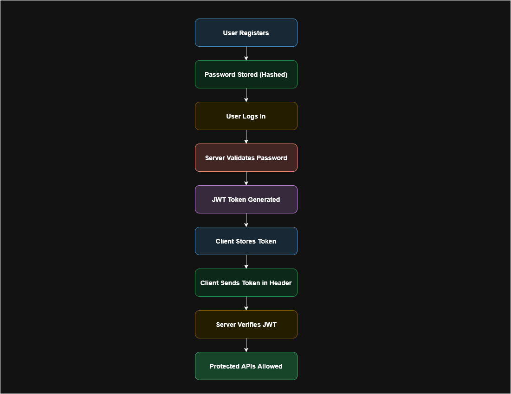
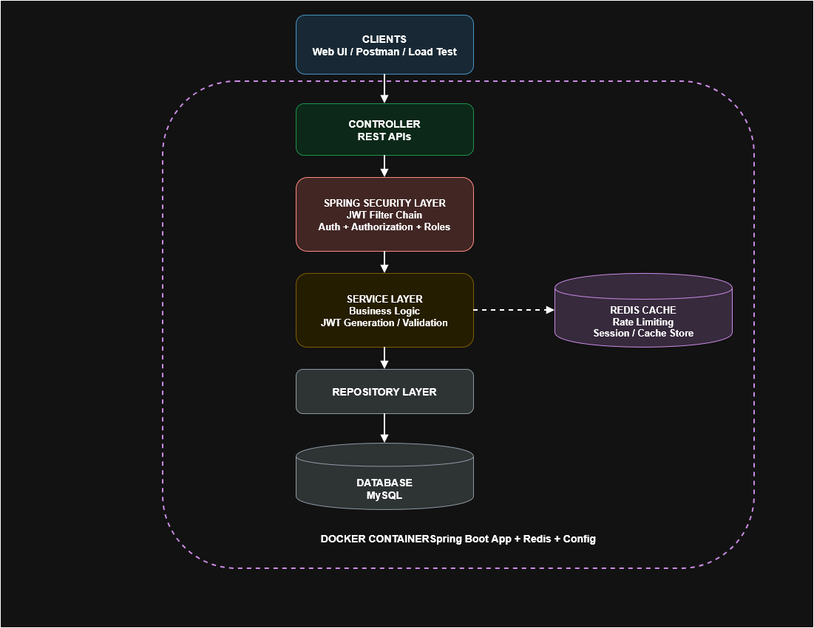

## SecureAuthAPI
While building backend for Banking app, ecommerce, Admin dashboard or SaaS Platform. We have to figure out these problems:
- User Must login securely [we can use JWT authentication]
- Passwords must be safe [Password Hashing]
- Only admin access admin APIs [Role based access]
- Prevent Brute Force login [Rate limiting]
- Avoiding hitting database repeatedly [Redis caching]
- Secure APIs [Spring security]
- Deploy easily [Using Docker]

To solve this problem I have built **SecureAuthAPI**, here i demonstrated how using *Java* and *SpringBoot* Framework to built RESTAPIs quickly as it handles web server, dependency injection, config, security, database connection
- While *SpringSecurity* handles authentication, authorization, password encryption, security filters. Now instead of storing sessions in server memory 
- I have used JWT (*JSON Web Token*: a token used to authenticate user). 
- I have also used *Redis*(In memory database used for caching, as its faster than mysql and can store user sessions and cached user data). 
- Last I have used *Docker* to package the application into a container.

## What's New / Recent Updates
Here is what was recently updated to make this project resume and publication-ready:
- **Clean UI Dashboard**: Added a student-friendly web interface `home.html` at `http://localhost:8080` to interactively test login, JWTs, and rate limiting.
- **Python Load Testing Tool**: Added a Python script `load_test.py` to simulate high traffic and verify the Redis rate limiter.
- **One-Click Startup**: Fixed the `SecureAuthAPI.bat` script so you can run the entire project with a single command without needing manual key presses. Just type `./SecureAuthAPI.bat` in your terminal or double click on that bat file if you are on windows. 


- **Comprehensive Documentation**: Refactored detailed explanations out of the README and into a dedicated `docs/` folder to make this file easy to read.
- **Bug Fixes**: Resolved HTTP 400 Bad Request errors and fixed CSS overflow issues in the console UI.

## In-Depth Documentation
Check the `docs/` folder for detailed guides on how each part works:
- [Architecture & Filters](docs/architecture.md)
- [JWT & Role-Based Access](docs/jwt_authentication.md)
- [Redis & Session Management](docs/redis_integration.md)
- [Load Testing](docs/load_testing.md)
- [Docker Setup](docs/docker_setup.md)

## Project Structure
```bash
secureauthapi
│
├── src/main/java/com/example/auth
│   ├── controller # handles HTTP requests
│   ├── service    # business logic (hashing pass, validating login)
│   ├── repository # database operations
│   ├── model      # database tables/entities
│   ├── security   # authentication logic (JWT generation/validation, Security Filters)
│   ├── config     # configuration for Redis and Security
│   └── middleware # filters (IP Filter -> Rate Limit Filter) executed before Controller
│
├── docs/          # detailed architectural and feature documentation
├── resources/
│   ├── application.yml
│   └── templates/home.html # The UI Dashboard
│
├── pom.xml
├── SecureAuthAPI.bat # One-click run script
├── load_test.py      # Python load testing script
└── Dockerfile
```

## Authentication Flow
```bash
User registers
      ↓
Password stored hashed
      ↓
User logs in
      ↓
Server validates password
      ↓
JWT token generated
      ↓
Client stores token
      ↓
Client sends token in header
      ↓
Server verifies JWT
      ↓
Protected APIs allowed
```



## Architecture 
```bash
Client (Postman / Frontend UI / Python Script)
          ↓
Controller
          ↓
Service
          ↓
Repository
          ↓
Database

Security Layer
   JWT Validation
   Rate Limiting
   IP Filtering

Cache Layer
   Redis
```



## To run on localhost
- **Windows**: Double click the `SecureAuthAPI.bat` file, or type `./SecureAuthAPI.bat` in the terminal. It automatically builds the project, starts the Spring Boot server, and opens the UI in your browser.
- **Manual (Any OS)**: Type `mvn clean install` and then `mvn spring-boot:run`.

## To Containerize in Docker
- To build docker container: `docker build -t secureauthapi .`
- To run docker container: `docker run -p 8080:8080 secureauthapi`
- Or use docker-compose: `docker-compose up --build`

## Load Tests
K6 Load Testing Screenshot when 5000 users are hitting the server


## TO Run
Just open Docker Desktop, and run
```bash
docker-compose up --build
```   