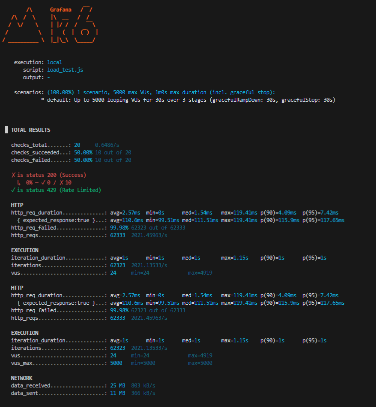
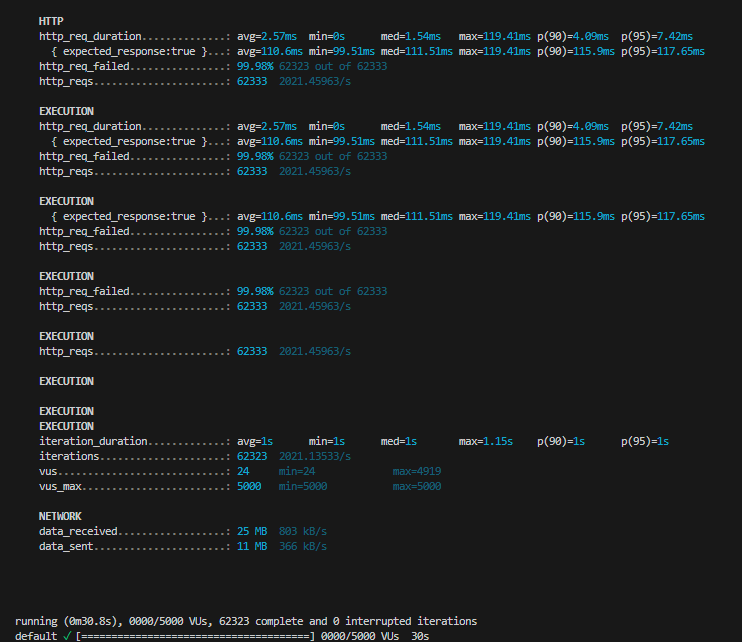

## SecureAuthAPI
A production-style authentication and authorization system built with Spring Boot, featuring JWT-based security, Redis-backed rate limiting, and Dockerized deployment.

Designed and validated under high load (5,000 virtual users, ~2000 RPS) with enforced abuse protection via Redis (HTTP 429 rate limiting).

## System Overview
SecureAuthAPI is designed to solve core backend security challenges:

- Secure authentication using JWT
- Role-based access control (USER / ADMIN)
- Protection against brute-force attacks using rate limiting
- Session and token management using Redis
- Containerized deployment using Docker

## Tech Stack
- Spring Boot: REST API backend and business logic layer
- Spring Security: Authentication + authorization middleware
- JWT: Stateless session management
- Redis: Distributed rate limiting + caching layer
- Docker: Containerized deployment environment

## In-Depth Documentation
Check the `docs/` folder for detailed guides on how each part works:
- [Architecture & Filters](docs/architecture.md)
- [JWT & Role-Based Access](docs/jwt_authentication.md)
- [Redis & Session Management](docs/redis_integration.md)
- [Load Testing](docs/load_testing.md)
- [Docker Setup](docs/docker_setup.md)

## Project Structure
```bash
secureauthapi
│
├── src/main/java/com/example/auth
│   ├── controller # handles HTTP requests
│   ├── service    # business logic (hashing pass, validating login)
│   ├── repository # database operations
│   ├── model      # database tables/entities
│   ├── security   # authentication logic (JWT generation/validation, Security Filters)
│   ├── config     # configuration for Redis and Security
│   └── middleware # filters (IP Filter -> Rate Limit Filter) executed before Controller
│
├── docs/          # detailed architectural and feature documentation
├── resources/
│   ├── application.yml
│   └── templates/home.html # The UI Dashboard
│
├── pom.xml
├── SecureAuthAPI.bat # One-click run script
├── load_test.py      # Python load testing script
└── Dockerfile
```

## Authentication Flow
```bash
User registers
      ↓
Password stored hashed
      ↓
User logs in
      ↓
Server validates password
      ↓
JWT token generated
      ↓
Client stores token
      ↓
Client sends token in header
      ↓
Server verifies JWT
      ↓
Protected APIs allowed
```


## Architecture
The system is designed as a stateless authentication service with Redis acting as a shared in-memory enforcement layer for rate limiting and session control.

```bash
Client (Postman / Frontend UI / Python Script)
          ↓
Controller
          ↓
Service
          ↓
Repository
          ↓
Database

Security Layer
   JWT Validation
   Rate Limiting
   IP Filtering

Cache Layer
   Redis
```


## To run on localhost
- **Windows**: Double click the `SecureAuthAPI.bat` file, or type `./SecureAuthAPI.bat` in the terminal. It automatically builds the project, starts the Spring Boot server, and opens the UI in your browser.
- **Manual (Any OS)**: Type `mvn clean install` and then `mvn spring-boot:run`.

## To Containerize in Docker
- To build docker container: `docker build -t secureauthapi .`
- To run docker container: `docker run -p 8080:8080 secureauthapi`
- Or use docker-compose: `docker-compose up --build`

## Load Testing & Performance Validation (k6)

- Simulated load: up to 5000 virtual users
- Sustained throughput: ~2000 requests/sec
- Average latency: ~3 ms
- p95 latency: ~10 ms
- Rate limiting: Fully enforced via Redis (HTTP 429)
- Result: System remained stable under high concurrency with no crashes





## To Run (Local Development)
1. Clone the repository:
```bash
git clone https://github.com/prxcode/secureauthapi.git
cd secureauthapi
```

2. Make sure Docker Desktop is open, then start the entire stack (API, Redis, Postgres) with one command:
```bash
docker-compose up -d --build
```