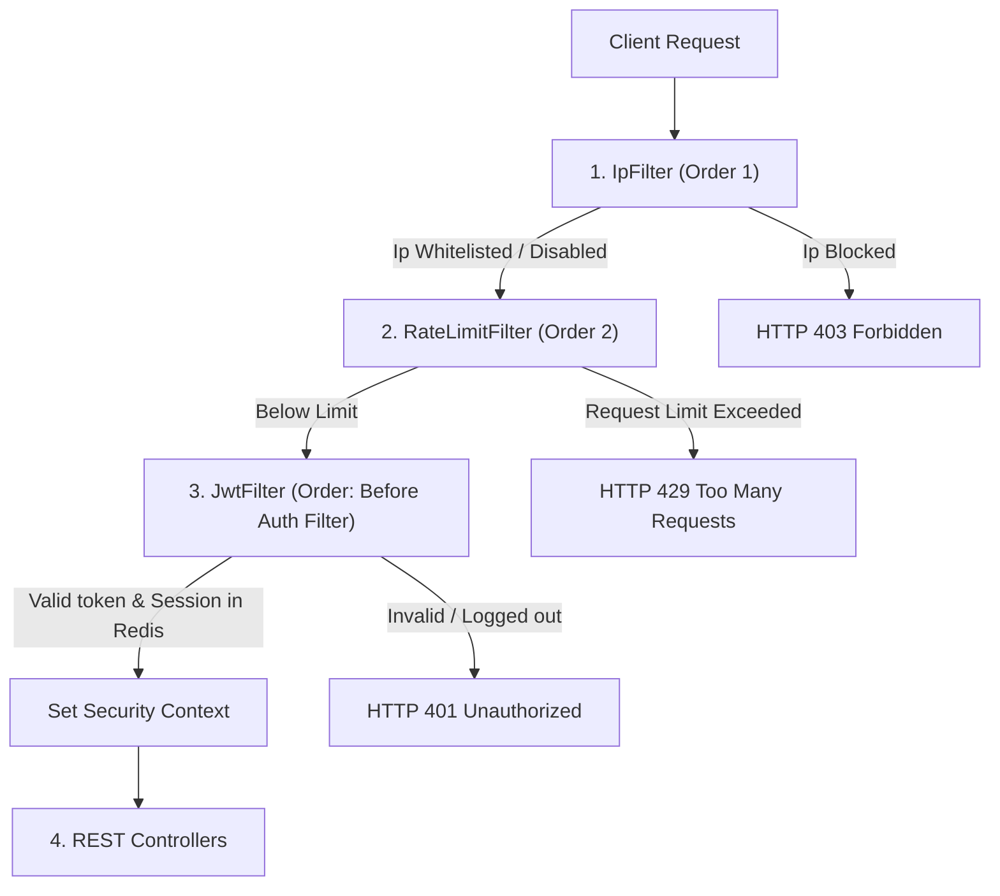

# Service Architecture & Filter Pipeline

SecureAuthAPI is designed as a secure, stateless authentication gateway. Requests entering the application pass through an ordered filter pipeline to ensure network safety, rate-limiting, and cryptographic authorization before hitting core business controllers.

---

## The Middleware Filter Pipeline

Every request is intercepted by Spring Security's filter chain. We configure three custom filters ahead of the standard Username-Password Authentication process.



### 1. IP Whitelist Filter (`IpFilter`)
- **Execution Order**: `1` (Highest Precedence)
- **Role**: Blocks client requests early based on source IP whitelisting configured in `application.yml`.
- **Failure Behavior**: Immediately halts the request chain returning an `HTTP 403 Forbidden` JSON block.

### 2. Redis Rate Limiter (`RateLimitFilter`)
- **Execution Order**: `2`
- **Role**: Dynamically counts client requests in a fixed 60-second window. It increments a Redis key `rate:limit:<IP>` with automatic expiry.
- **Failure Behavior**: If the rate limit (10 requests) is exceeded, it halts execution returning `HTTP 429 Too Many Requests`. If Redis is offline, it fails safely by blocking and returning `HTTP 500 Internal Server Error` (no silent fallbacks).

### 3. JWT Interceptor (`JwtFilter`)
- **Execution Order**: Custom (Before `UsernamePasswordAuthenticationFilter`)
- **Role**: Inspects the `Authorization: Bearer <token>` header, validates the signature, extracts claims, and queries Redis to verify the token session is active.
- **Failure Behavior**: Rejects invalid, expired, or blacklisted tokens (e.g., from logged-out sessions) returning `HTTP 401 Unauthorized`. If Redis is offline, it returns `HTTP 500 Internal Server Error` to ensure revoked tokens cannot bypass checks.

---

## Component Layout

The code follows standard enterprise Spring Boot architecture:

```text
com.example.auth/
│
├── config/
│   └── RedisConfig.java       (Redis Template configuration beans)
│
├── controller/
│   ├── AuthController.java    (Authentication REST routes: Login, Logout)
│   └── ApiController.java     (Secure resource REST routes: User profile, Admin)
│
├── middleware/
│   ├── IpFilter.java          (IP Filtering gateway filter)
│   └── RateLimitFilter.java   (Redis-based Rate Limiter filter)
│
├── model/
│   ├── User.java              (Data Entity representing User details)
│   └── Role.java              (Authorization Roles: USER, ADMIN)
│
├── security/
│   ├── JwtUtil.java           (JWT Token generation, parsing, and signatures)
│   ├── JwtFilter.java         (Requests auth context processing filter)
│   ├── PasswordConfig.java    (BCrypt Password encoder bean definition)
│   └── SecurityConfig.java    (Spring Security Chain, Stateless Policies & RBAC)
│
└── service/
    ├── AuthService.java       (Business logic validating logins and managing Redis sessions)
    ├── InMemoryUserService.java (Mock Database repository for storing user records)
    └── CustomUserDetailsService (Bridges user repository with Spring Security context)
```
